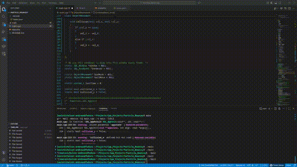

<h1 align="center">
  2D Physics Simulation (C++ / SDL3)
</h1>

<p align="center">
  <a href="#introduction">Introduction</a> •
  <a href="#project-progress">Project Progress</a> •
  <a href="#challenges">Challenges</a> •
  <a href="#build">Build</a> •
</p>

---

## Introduction

This project is a real-time 2D physics simulator written in C++ using SDL3.

It was developed to explore core concepts behind physics engines, including
numerical integration, collision detection, and low-level rendering, without
relying on external physics libraries.

The main focus is on building reusable simulation components and gaining
hands-on experience with engine-style architecture.

---

## Project Progress

### Current Features

- Real-time rendering using SDL3
- Frame-rate independent motion
- Gravity and velocity integration
- Boundary collision handling
- Rectangle and circle primitives
- Basic collision response

### Demo


### Planned Features

- Proper circle-to-circle collision
- Rotational dynamics and torque
- Friction simulation
- Spatial partitioning for performance
- Configurable simulation parameters via UI

---

## Challenges

- **Learning SDL3:** Understanding rendering contexts, window creation, and the event loop. First milestone was successfully rendering a single object on-screen.  
- **Object-Oriented Design:** Transitioning from procedural C to C++ classes. Learned constructors, public/private access, and modular design principles.  
- **Collision Detection:** Early debugging used dynamic color changes for visual feedback. Implementing robust collision detection required careful handling of object bounds.  
- **Velocity & Gravity:** Added frame-rate independent motion in both axes. Simulated gravity using:

```cpp
vel_y += gravity * deltaTime;
```
and energy loss for bounces:
```cpp
vel_y = -vel_y * 0.8;
```
- **Ball Creation:** Beyond creating the loop for the ball, I needed to account for its center-based coordinates rather than SDL's rectangle-based edge coordinates. This required adding or subtracting the radius for the top, bottom, left, and right boundaries. The same approach was applied to the rectangle, replacing radius with width and height.

- **Universal Movement Class:** Instead of separate movement variables for each shape, I created ObjectMovement as a universal class that can handle any shape. This reduced code duplication and made physics updates consistent across objects.


## Build

### Requirements

- C++17-compatible compiler (GCC, Clang, or MSVC)
- GNU Make
- SDL3 development libraries

### Dependencies

This project uses:

- **SDL3** for windowing, input, and rendering

Make sure SDL3 is installed on your system before building.

#### MacOS 
In terminal / Homebrew
`brew install sdl3`

#### Linux 
**(Debian / Ubuntu)**
`sudo apt install libsdl3-dev`

**Fedora / Redhat**
`sudo dnf install libsdl3-dev`

#### Windows
1. Go to https://github.com/libsdl-org/SDL/releases
2. Download the SDL3 development zip for your compiler (e.g., MSVC or MinGW).
3. Extract it.
4. Put the include folder in your compiler’s include path, and the .lib/.dll in your lib path.
5. Copy SDL3.dll next to your executable at runtime.
   
### Building from Source

#### 1. Clone the Repository

```bash
git clone https://github.com/LewisNA14/Physics_Particle_Sim.git
cd Physics_Particle_Sim
```
#### 2. Compile the project using the provided Makefile:
Once opened on the IDE go to:
1. `make clean`
2. `make`

#### 3. Run the compiled executable:
`./main`
